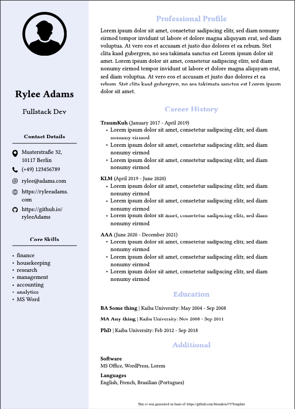

# Typst CV Template

This project provides a template for generating a curriculum vitae based on the great [typst programming language](https://typst.app). Please refer to the official documentation of typst to learn how to compile the given template.

## Parameters

The template expects the folowing three parameters:

- jsonFilePath
  - this is a string which must point (relatively from the root of this project) to the file you want to use
  - it should be of the same structure as shown in the test
  - (nearly) all of the keys which are listed in the test/applicant.json file are currently being used
- photoPath
  - this is a string which must point (relatively from root/content) to the file you want to use (this is inconvenient and will be fixed in future)
  - it will be shown in the top left corner of the cv
- locale
  - the locale the cv template should use
  - the supported locales are the filenames of the _json_ files which you find under _translations_

## Example output

